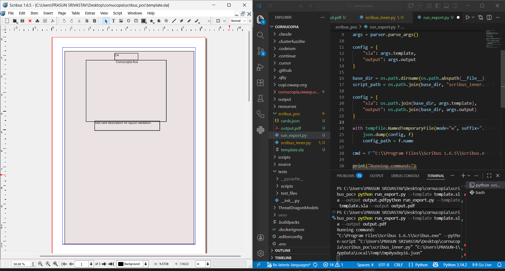
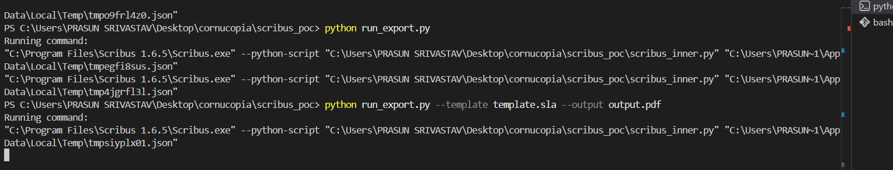
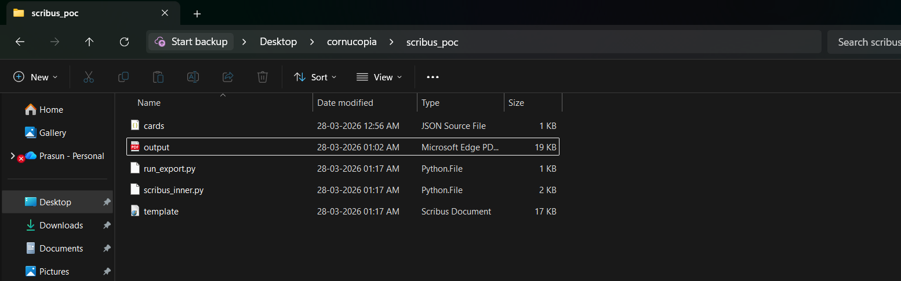

# Scribus Cornucopia PoC

## Overview

This is a proof-of-concept demonstrating how Scribus can be used to generate print-ready PDFs from structured card data.

## Features

* Scribus headless execution via Python
* Template-based card rendering (`.sla`)
* Dynamic multi-page PDF generation
* Named frame injection (`CARD_CODE`, `CARD_TITLE`, `CARD_DESC`)

## Run

```bash
python run_export.py --template template.sla --output output.pdf
```

## Output

* Generates `output.pdf`
* Demonstrates Scribus automation pipeline
* Validates feasibility for OWASP Cornucopia project

## Example Output

(See `output.pdf` in this repo)

## Project Structure

* `run_export.py` → CLI runner
* `scribus_inner.py` → Scribus script
* `template.sla` → Card layout template
* `cards.json` → Input data
* `output.pdf` → Generated result

  ## Screenshots

### Generated PDF


### Terminal Execution


### Project Structure


## Note

This PoC validates the Scribus-based approach proposed for OWASP Cornucopia GSoC 2026.
